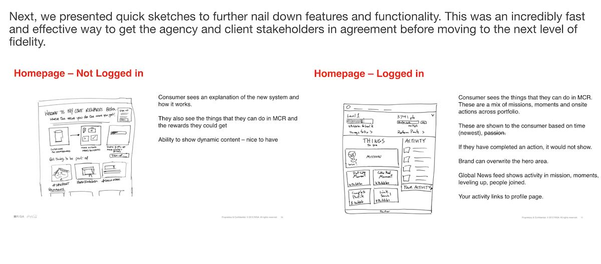

Client: Coca-Cola Agency: R/GA Role: Client liaison and Lead Experience Designer (XD) for technical design and creative direction for this large scale ecommerce system. Oversaw several other XDs designing game mechanics, process flows, site wireframes, and 3rd party partner User Guide documentation.
Coca-Cola was looking to reduce costs (manufacturing, storing, and distributing merchandise) and make their My Coke Rewards loyalty platform more relevant to the digital generation. 
We reinvented the concept to focus on ‘gamifying’ with real-world sponsorships, digital content partnerships, mobile-centric participation, while still working with the Adobe CQ core frameworks already in place. 

## Strategy ##

## Deliverables ##

## Impact ##

## Thank You ##